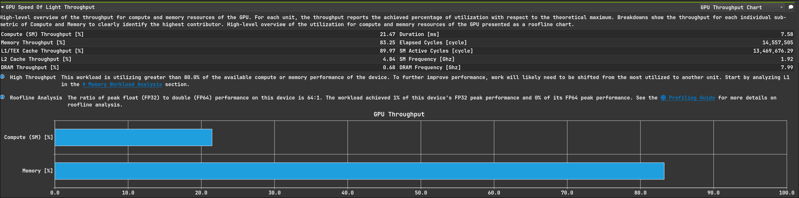
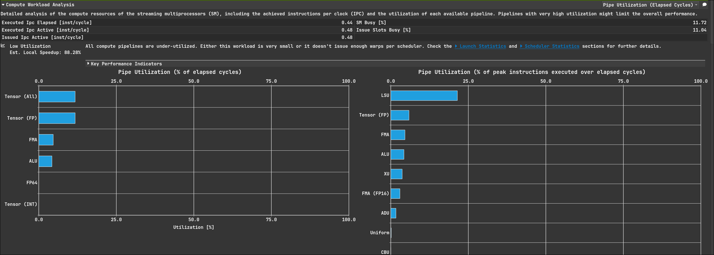
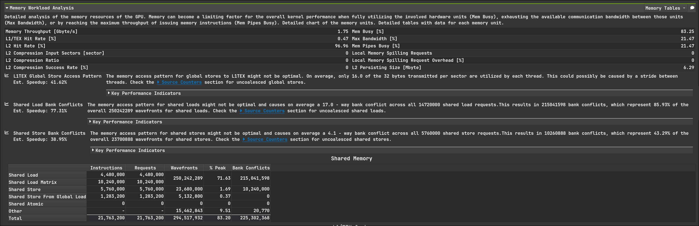
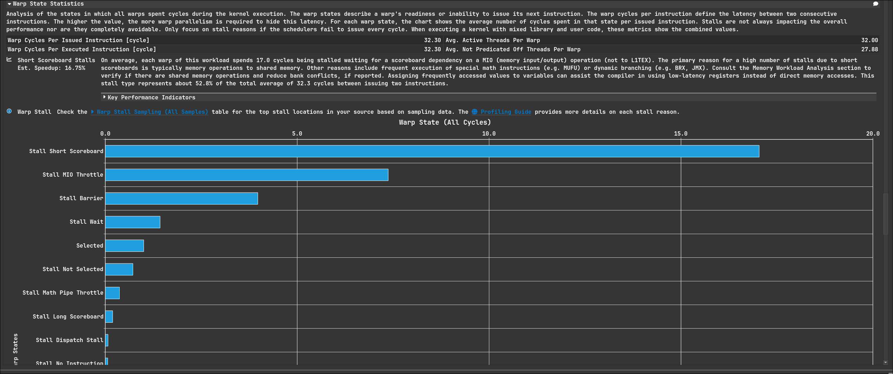

# FlashAttention Profiling记录
由于算子复杂，新增draw文件夹保留描述计算的示意图，使用excalidraw，使用MMA PTX

excalidraw文件保存在docs/draw下，以下是导出的两张图

### Light Theme

### Dark Theme

## FA kernel 1:
单个kernel直接负责一段Q的计算，Q一次载入smem，K和V序列会循环载入smem，warp内通信较复杂，且需要block level reduce

当前是图方便的写法，自然引出两个优化点
- 当前要求Q可完全装进smem,可优化同一块空间循环加载
- 如图，每个warp负责一块，所以需要block level reduce,可设计为每个warp负责一行S
- $S$ 为 $16 * 8$ 的矩阵，后续和 $V$ 的乘法中需要装入 $16*16$ 的寄存器片段中，形状方便的情况下可走寄存器而非走smem
- 寄存器使用过多，可考虑是否能最大程度复用

### Throughput

拉完了，因为访存极其低效，虽然用了mma但目前还没做swizzle，意料之中

### Compute Workload Analysis

目前的实现有大量block内通信，加上低效访存，所以利用率不高

### Memory Workload Analysis

### Warp State Statistics

如ncu所言
> On average, each warp of this workload spends 17.0 cycles being stalled waiting for a scoreboard dependency on a MIO (memory input/output) operation (not to L1TEX). The primary reason for a high number of stalls due to short scoreboards is typically memory operations to shared memory. Other reasons include frequent execution of special math instructions (e.g. MUFU) or dynamic branching (e.g. BRX, JMX). Consult the Memory Workload Analysis section to verify if there are shared memory operations and reduce bank conflicts, if reported. Assigning frequently accessed values to variables can assist the compiler in using low-latency registers instead of direct memory accesses. This stall type represents about 52.8% of the total average of 32.3 cycles between issuing two instructions.

还是smem访问拉胯导致的

### 总结
smem的问题好解决，实际上该模式本身也不高效，各种各样的缺点都被smem的逆天访存掩盖了，下一个kernel会解决bank conflict并使用不需要block内reduce的方法

