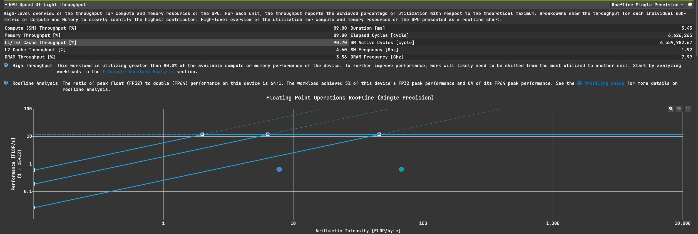
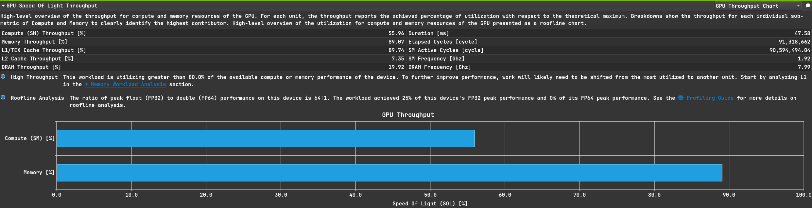
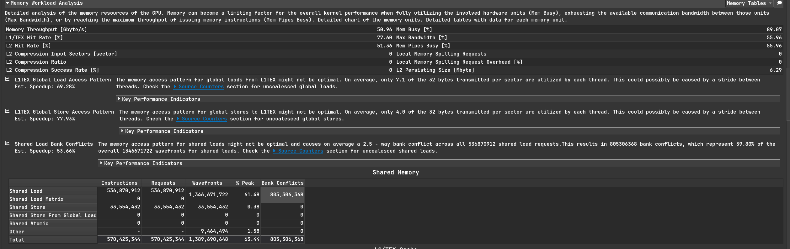

# GEMM Profiling记录

## GEMM kernel 1:
仅仅使用shared memory做分块矩阵乘
数据规模为$1024*1024*1024$,一个块处理$32*32$个元素
### Throughput

可见任务负载已经让SM很繁忙了，但这不能说明问题，我们可以通过Roofline去分析实际算力如何
#### Roofline Analysis

分块形状是$32*32$，因为计算是按Thread Block隔离的,一个Block内有1024 threads，一个thread的计算量为1024 * 2 FLOP, 整个块的AI为$1024 * 1024 * 2 / 2 * 32 * 1024 * 4 + 1024 * 4 = 7.87$
 
ncu给出的L1 AI是7.77, 差不多，从图上也能看出，算力被完全浪费了，这指出了优化方向，应该让线程的计算任务更重一些，GEMM本身是三级算子，利用数据的局部性可以让运算更密集

### Compute Workload Analysis

可以看到计算单元非常空闲，只有LSU(Load/Store Uint)繁忙，符合Roofline部分分析的

### Memory Workload Analysis

L2的命中率很高，这一定程度上会让DRAM的AI变大，此外smem无bank conflict，other那一栏我也不知道是啥，目前的smem访存模式是高效的
L1难以分析，因为硬件上L1的策略是需要权衡的，而不是L2那样较为固定

### 总结
没用充分发挥硬件计算能力，应该利用GEMM的数据规律加强计算负载

## GEMM kernel 2:

这次改变了计算的形状，现在是$4096*4096*4096$, 每个线程块只有8个warp, 负责$8*8=64$个元素的计算，所以这次的SM利用率会低点，因为上次每个SM有32个warp,现在只有8个，这整体上就降低了隐藏延迟的能力，会对各种数据造成影响
对比上次，这次的优化在于每个线程负责一块二维区域的计算
### Throughput

因为warp更少了所以SM吞吐降低
#### Roofline Analysis

这次的算力明显被更好的利用了(纵坐标和前面的图是不一样的)

或者只关注DRAM的roofline,离峰值更近了

### Compute Workload Analysis

这次的计算单元的利用率也来到了25%

### Memory Workload Analysis

问题暴露了，改为每个线程计算一块2d区域后，访问smem的模式发生了改变，造成了大量的bank conflict，这指明了优化的方向，需要更友好的smem访问模式

### 总结
改进后计算是更密集了，但smem访问模式仍然是低效的

