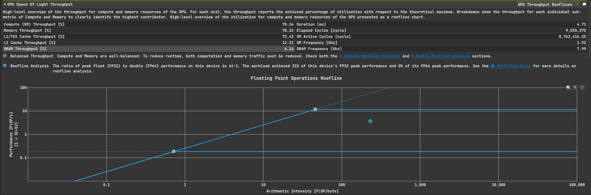
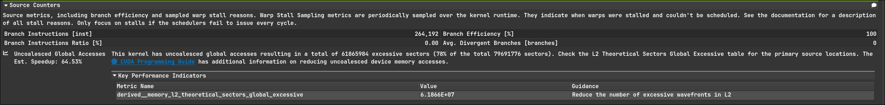
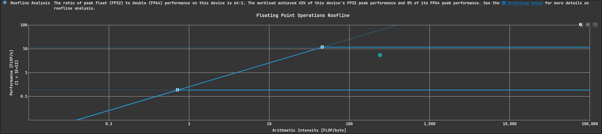
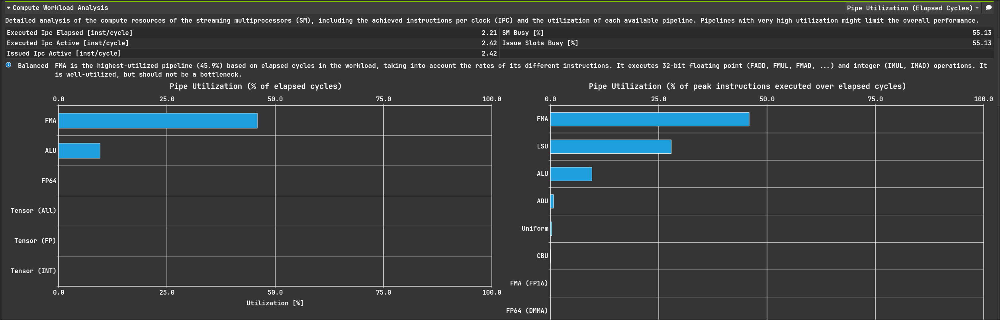
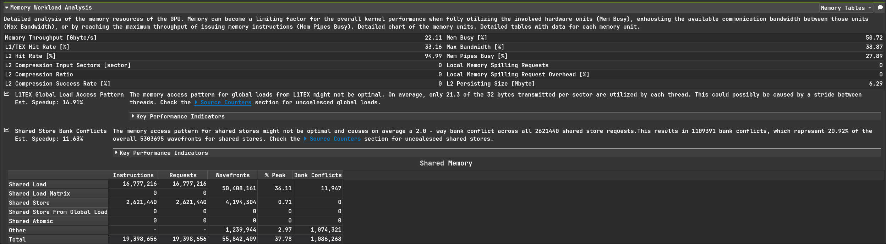

# GEMM Profiling记录

## GEMM kernel 1:
仅仅使用shared memory做分块矩阵乘
数据规模为$1024*1024*1024$,一个块处理$32*32$个元素
### Throughput

可见任务负载已经让SM很繁忙了，但这不能说明问题，我们可以通过Roofline去分析实际算力如何
#### Roofline Analysis


分块形状是$32*32$，因为计算是按Thread Block隔离的,一个Block内有1024 threads，一个thread的计算量为1024 * 2 FLOP, 整个块的AI为$1024 * 1024 * 2 / 2 * 32 * 1024 * 4 + 1024 * 4 = 7.87$
 
ncu给出的L1 AI是7.77, 差不多，从图上也能看出，算力被完全浪费了，这指出了优化方向，应该让线程的计算任务更重一些，GEMM本身是三级算子，利用数据的局部性可以让运算更密集

### Compute Workload Analysis


可以看到计算单元非常空闲，只有LSU(Load/Store Uint)繁忙，符合Roofline部分分析的

### Memory Workload Analysis

L2的命中率很高，这一定程度上会让DRAM的AI变大，此外smem无bank conflict，other那一栏我也不知道是啥，目前的smem访存模式是高效的
L1难以分析，因为硬件上L1的策略是需要权衡的，而不是L2那样较为固定

### 总结
没用充分发挥硬件计算能力，应该利用GEMM的数据规律加强计算负载

## GEMM kernel 2:

这次改变了计算的形状，现在是$4096*4096*4096$, 每个线程块只有8个warp, 负责$8*8=64$个元素的计算，所以这次的SM利用率会低点，因为上次每个SM有32个warp,现在只有8个，这整体上就降低了隐藏延迟的能力，会对各种数据造成影响
对比上次，这次的优化在于每个线程负责一块二维区域的计算
### Throughput

因为warp更少了所以SM吞吐降低
#### Roofline Analysis

这次的算力明显被更好的利用了(纵坐标和前面的图是不一样的)

或者只关注DRAM的roofline,离峰值更近了

### Compute Workload Analysis

这次的计算单元的利用率也来到了25%

### Memory Workload Analysis

问题暴露了，改为每个线程计算一块2d区域后，访问smem的模式发生了改变，造成了大量的bank conflict，这指明了优化的方向，需要更友好的smem访问模式

### 总结
改进后计算是更密集了，但smem访问模式仍然是低效的

## GEMM kernel 3:
按warp去分块，减少bank conflict， 数据规模为$2048*2048*2048$,因为保留block为$128*128$，这样负载更合理一些

### Throughput

没什么好说的了不想说了

#### Roofline Analysis

此时AI到了232.67，算力进一步提升

### Compute Workload Analysis

因为减少了bank conflict，所以利用率就上去了

### Memory Workload Analysis

这是warp分块的主要目的，可见bank conflict大量减少

### Source Counters
不过ncu也指出，我们存在大量的非合并gmem访问 


只有大约 22% 的访问是高效的

确实,以下代码完全是没有合并访存
```cuda
    for (int a = 0; a < load_a_per_thread; ++a) {
        uint32_t smem_idx = threadIdx.x + a * threads_per_block;
        uint32_t global_a_idx = (smem_idx % BM) * K + (smem_idx / BM) + k * bK;
        a_smem[smem_idx] = A[global_a_idx];
    }
```

### 总结
目前的gmem访问模式有很大问题，我们应该改变访存模式并使用向量化访存指令去优化kernel

## GEMM kernel 4:
仅仅只是在3的基础上使用向量化访存，让gmem访问尽可能合并
### Throughput

可见在访存变得更高效后，访存的吞吐都降低了，并不是吞吐都拉满就是好，主要问题在于计算单元是否依赖存储器上的数据，如果不依赖那么计算和访存都一起不停的跑，那很好，但如果依赖的话计算单元在得到操作数之前会一直无法工作。我们的优化每一步都在降低访存的需求，GEMM是3级算子，运算的增长幅度超过数据规模的扩大，这样的优化方向结果毫无疑问是正确的，但也有点没发挥硬件能力，这应该和形状关系比较大

ncu指出 *This workload exhibits low compute throughput and memory bandwidth utilization relative to the peak performance of this device. Achieved compute throughput and/or memory bandwidth below 60.0% of peak typically indicate latency issues. Look at  Scheduler Statistics and  Warp State Statistics for potential reasons.*

这个情况下隐藏延迟的能力没有被发挥好
我们可以增大block内线程的数量，用更多的warp去隐藏延迟，但这样对smem和寄存器大小有要求，再来就是做软件流水

#### Roofline Analysis

访存更高效，计算单元也就不用停顿太久，算力提升

### Compute Workload Analysis

和上面说的一样的，利用率提升是毫无疑问的

### Memory Workload Analysis

说实话我也没想明白为什么这里还有bank conflict，因为向量化访存的关系，数字是进一步下降了

答：这里的bank conflict是L1和smem的冲突，是物理硬件上的，从source页可以看出我们的访存无bank conflict


### Source Counters

访问gmem是按block去做的，这里还不能合并只能归咎于block的形状了

### 总结
更高效了，但也因此访存没有发挥硬件更强大的能力

