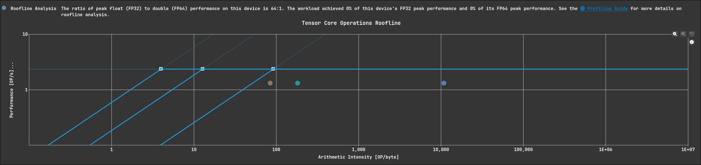

# HGEMM Profiling记录
因为也是GEMM,常见问题在SGEMM都遇到过了，如果真有人读这个的话，请先查看[这里](sgemm.md)，这篇的话内容上计划更多偏笔记一些，节奏更快，不会再从naive实现一个个往上叠优化技巧了，而是直接应用全部直观的优化技巧，毕竟已经出新手村了，记点不一样的就好
## Tensor Core
Tensor Core 是 NVIDIA GPU 上的 专用矩阵乘累加（MMA）硬件单元，用于执行下面这种固定形状的计算：
$𝐷=𝐴×𝐵+𝐶$

从Volta开始，往后渐渐增强Tensor Core的计算能力

可以使用wmma api去调用tc(Tensor Core)

流程为
```cuda
wmma::fragment<wmma::matrix_a,      16, 16, 16, half, wmma::row_major> a_frag;
wmma::fragment<wmma::matrix_b,      16, 16, 16, half, wmma::col_major> b_frag;
wmma::fragment<wmma::accumulator,   16, 16, 16, float>                  c_frag;

wmma::fill_fragment(c_frag, 0.0f);

wmma::load_matrix_sync(a_frag, a_smem_ptr, K);

wmma::load_matrix_sync(b_frag, b_smem_ptr, N);

wmma::mma_sync(c_frag, a_frag, b_frag, c_frag);

wmma::store_matrix_sync(C_ptr, c_frag, N, wmma::mem_row_major);

```
wmma的w就是warp的意思，nv提供warp级的编程模型去使能tc,所以HGEMM的思路依然是 Block分块->Warp分块,但一个warp负责的那块区域不需要再计算复杂的索引，而是直接使用tc去计算，知道这些便得到了代码中的`hgemm_wmma`，使用fp32作为累加器保证精度
### load_matrix_sync
需要了解每个线程都在加载哪些元素，知道这个才能避免bank conflict（smem->reg）
## memcpy_async
Ampere开始支持的新的数据通路，允许gmem->smem,而不经过寄存器，也能对cache的策略进行自定义

相关的api就不写了，因为我也不清楚

## HGEMM kernel 1:
只是使用了tc，懒得测了

## HGEMM kernel 2:
加上了gmem->smem的异步拷贝，而load_matrix_sync造成了大量bank conflict

## HGEMM kernel 3:
使用Padding去解决load_matrix_sync造成的bank conflict



其实优化思路完全能从SGEMM迁移，都不用看了，异步拷贝这里实际上就是同步去做的，肯定会报Warp Stall，接下来就是做排软件流水也就是双缓冲，SGEMM真是最好的老师

