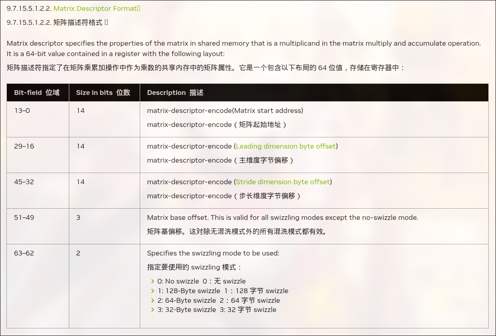
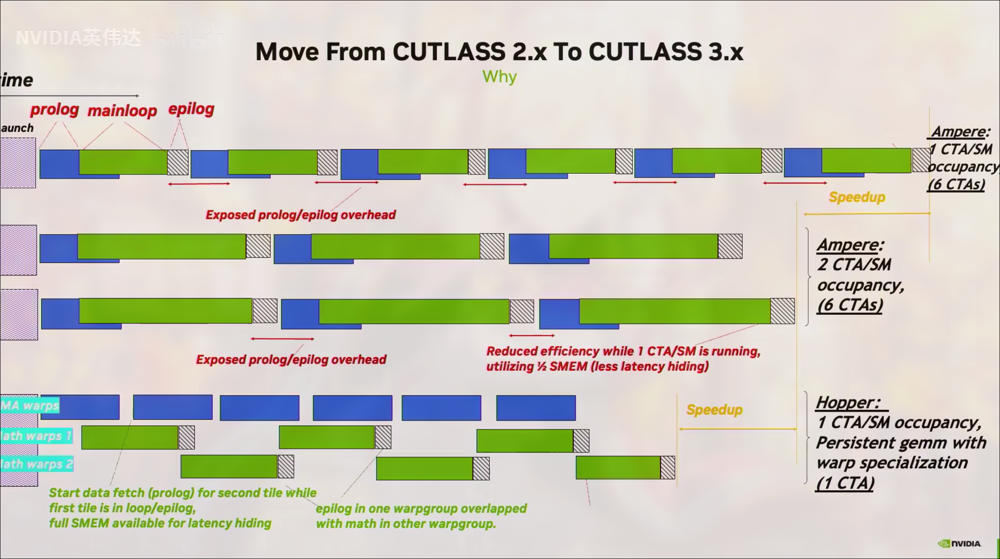
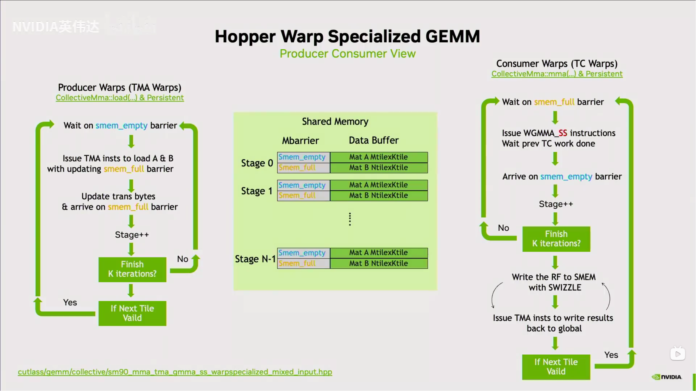

# Hopper特性笔记
- [Hopper特性笔记](#hopper特性笔记)
  - [前言](#前言)
  - [前置基础](#前置基础)
    - [Proxy](#proxy)
  - [Tensor Core](#tensor-core)
    - [WGMMA](#wgmma)
  - [Async execution](#async-execution)
    - [New Barrier](#new-barrier)
    - [TMA](#tma)
      - [gmem2smem](#gmem2smem)
      - [smem2gmem](#smem2gmem)
  - [Hierarchy](#hierarchy)
    - [Thread Block Clusters](#thread-block-clusters)
    - [DSMEM](#dsmem)
  - [编程范式](#编程范式)
    - [Warp-Specialization](#warp-specialization)
    - [Perpistent kernel](#perpistent-kernel)
    - [cooperative](#cooperative)
    - [ping-pong](#ping-pong)
## 前言
Hopper开始NV GPU开始DSA化，对于AI算子，不再使用`SIMT`掩盖延迟，而是靠异步执行打满计算单元，这和npu已经没区别了，英伟达称其为第一代异步GPU，而且NV明确说明后续架构（*Blackwell*）不会兼任部分Hopper特性

新的东西还是比较多的，也不是很简单，而信息又较分散，甚至我参考的资料有很多错误！！！所以写这样一篇笔记(~~也就是写给自己看的~~)
## 前置基础
### Proxy
这是需要理解的一个概念，贴出ptx手册的说明

> A memory proxy, or a proxy is an abstract label applied to a method of memory access. When two memory operations use distinct methods of memory access, they are said to be different proxies.
Memory operations as defined in Operation types use generic method of memory access, i.e. a generic proxy. Other operations such as textures and surfaces all use distinct methods of memory access, also distinct from the generic method.
A proxy fence is required to synchronize memory operations across different proxies. Although virtual aliases use the generic method of memory access, since using distinct virtual addresses behaves as if using different proxies, they require a proxy fence to establish memory ordering.

内存代理（memory proxy），或简称 代理（proxy），是一个用于描述内存访问方式的抽象标签。
当两个内存操作使用不同的内存访问方式时，称它们使用了不同的代理（different proxies）。

在 Operation types 中定义的内存操作使用的是通用的内存访问方式，即 通用代理（generic proxy）。
而其他操作（例如 纹理（textures） 和 表面（surfaces））则各自使用不同的内存访问方式，这些方式也都与通用访问方式不同，因此对应不同的代理。

代理栅栏（proxy fence）用于在不同代理之间同步内存操作。
尽管 虚拟别名（virtual aliases） 使用的是通用的内存访问方式，但由于通过不同虚拟地址进行访问的行为在效果上等同于使用不同的代理，因此仍然需要使用 代理栅栏 来建立内存顺序（memory ordering）。

可以简单理解为不同单元之间对内存可见性不同，这属于PTX内存模型的一部分，在cpu上，这种可见性问题多半是store buffer造成的，总之就这么理解吧

## Tensor Core
第四代Tensor Core，支持了FP8，支持FP32和FP16累加器

下文一致称呼Tensor Core为TC

### WGMMA
tile变大，以至于单个warp无法承担如此大的负载，为此将负载平摊到4个warp上，称为一个warpgroup，由于是4个warp执行一次wgmma

以往我们驱动TC只需要一个warp,使用的都是`mma.sync`,这自动要求了warp内线程全都同步到一个pc上，但wgmma需要4个warp,而warp的调度是复杂的，所以是无法直接想办法让4个warp同时发射的，于是wgmma变成了异步指令，需要手动等待指令的完成，硬件不会检测到相关hazard

wgmma的A矩阵可以位于寄存器或smem而B矩阵必须位于smem，累加器位于寄存器，为了减少寄存器的压力，一般让A位于smem,而后面会提到的TMA可以异步将数据从gmem拷到smem,且符合wgmma需要的数据布局

以下是m64nNk16形状下Aw位于寄存器时的寄存器布局

这个是累加器的

位于smem的数据，则需要提供描述符

为避免bank conflict,NV支持了各种各样的swizzle模式，且TMA也支持，不需要繁琐的手动计算

wgmma的标准使用使用方法为
- 将矩阵加载到指定位置
- wgmma.fence
- wgmma.mma.async
- wgmma.commit_group
- wgmma.wait_group

wgmma是异步的，需要在使用之前调用fence,这个会确保mma使用的寄存器完成前面的操作再执行mma,就是没有scoreboard嘛

commit_group和wait_group就对应的异步完成机制

## Async execution
这个部分会有比较麻烦，引入了太多异步指令，要做很多手动的同步来确保正确的依赖关系，而不是有scoreboard自动检测hazard，而且会引入很多可见性问题

### New Barrier
在Ampere的基础上barrier增加了关于事务的记数，这是为TMA而服务的，这部分网上较多都没解释清楚，于是自己查阅了PTX手册，有了较清晰的认识

首先事务的计数是和普通的计数是分开记录的，对于普通的计数，需要一个线程init对应的初始值，这里的init本质是`mbarrier.init.shared.b64`（*默认作用域为cta,即threadblock*）不论什么api都是调用这个ptx,这里简单称为`arrival`计数，另一个则是为异步内存事务完成机制提供的`tx`计数，只能手动增加tx计数，这通过barrier的expect_tx操作完成，tx计数理应由异步拷贝指令在完成全部拷贝后减少计数，对于arrival计数，线程可以通过barrier.arrive操作得到token,这个token包含barrier的状态，wait时需要这个token包含的信息，换句话说只要信息够用就行不必是完整的token,这就引入了更高效的barrier实现,在ptx中有对应指令而cuda c/c++无接口,wait barrier时只有两者的计数都变为0才可返回

### TMA
在Ampere上，LDGSTS扩展了数据通路，gmem可以直接到smem而无需寄存器的参与连cache策略也是可选的，但仍然需要显式计算地址，而TMA直接让地址都不用计算了，每个SM都有一个TMA,一个线程就可以跑满整个SM的带宽,只需要对应的描述符(没什么值得注意的这里就不提了)就可以驱动TMA单元疯狂干活，不论是gmem2smem还是smem2gmem都支持，但是有一点区别,他们的完成机制不同

#### gmem2smem
完成机制需要barrier,这会为barrier增加事务计数，数值为传输的数据的大小，具体的说，在调用`cp.async.bulk`时会设置当数据传输完成时对指定barrier对象的tx计数减操作，大小为传输的数据的字节数，在这条指令后必须手动增加barrier对象的tx计数（使用generic proxy），大小与上面对应，只有当barrier的arrival计数和tx计数都为0时，wait才会结束，另外这里应该是有隐式同步，TMA写smem属于async proxy,在wait后不需要fence就可以使用generic proxy去访问smem，但在写smem后需要手动fence以让TMA可见，才能用TMA完成smem2gmem的操作

#### smem2gmem
完成机制为`bulk async-group`，发出异步拷贝后`cp.async.bulk.commit.group`和`cp.async.bulk.wait.group.read`就好了

## Hierarchy
### Thread Block Clusters
新增的层次结构，为避免余数效应，在kernel启动时可配置最小cluster与预期cluster的大小，故代码不可硬编码

NV在GPC中实现了SM2SM的互联网络，GPC是硬件层级中的一组SM，它们在物理上总是紧密相邻，同一个GPC中的cta可互相访问各自的smem，这就是分布式smem
### DSMEM
要注意的就是需要同步，不能有cta先退出而位于同一个cluster的cta在读他的smem，新的层次结构让许多数据相关的指令多了新的数据通路
## 编程范式
这么多异步单元，已经不需要SIMT隐藏延迟了，编程上不再推荐SIMT而是`Warp-Specialization`
### Warp-Specialization
（*简写为WASP*）
访存交给了TMA,计算交给了TC,算力都是TC提供的，cuda core也就这样了，Warp-Specialization将编程模型变为生产者-消费者模型，生产者warp去不停调TMA,消费者warp调TC，只要能让TC一直干活就能达到理论算力，wgmma需要4个warp,消费者warp实际上以4个为一组，但生产者又不能污染wgmma,生产者warp也padding到4warp,但实际上工作的只有一个线程，这种情况下生产者根本不会需要什么寄存器资源却不得不开出128个线程，于是nv给出了动态调整寄存器大小的指令`setmaxnreg`

### Perpistent kernel
以往的启动多个cta每个cta处理一个tile已经消失了，取而代之的是单个cta处理多个tile,尽可能让cta一直在sm上，这样做是为了掩盖延迟，这样的设计在Blackwell还被加强了

对于计算密集型算子，Ampere及以后的架构的multi-stage pipeline是`prologue`+`mainloop`+`epilogue`
prolog预取下stage的数据，mainloop开始计算，epilog写入结果到gmem

这种模式需要启动很多的cta而每个cta负责一块tile，在SM视角就如上图所示，需要很多wave,而hopper的WASP结合perpistent kernel的设计则能在较低occupancy的情况下保持算力，其实这图里的模式是下面提到的ping pong模式，消费者A退出mainloop就让给消费者B进入mainloop,mainloop中会使用TC,通过这种策略让TC繁忙打满算力

### cooperative
消费者warp间合作处理一个大tile，也就是会同时进入epilog,这样TC就空闲了一段时间暴露了延迟
### ping-pong
至少两个消费者warp,A进入epilog就让B进入mainloop,两个连续打满tensor core，完美隐藏延迟打满算力
