# SGEMM Profiling记录

## SGEMM kernel 1: 
仅仅使用shared memory做分块矩阵乘
数据规模为$1024*1024*1024$,一个块处理$32*32$个元素
### Throughput

可见任务负载已经让SM很繁忙了，但这不能说明问题，我们可以通过Roofline去分析实际算力如何
#### Roofline Analysis


分块形状是$32*32$，因为计算是按Thread Block隔离的,一个Block内有1024 threads，一个thread的计算量为1024 * 2 FLOP, 整个块的AI为$1024 * 1024 * 2 / 2 * 32 * 1024 * 4 + 1024 * 4 = 7.87$
 
ncu给出的L1 AI是7.77, 差不多，从图上也能看出，算力被完全浪费了，这指出了优化方向，应该让线程的计算任务更重一些，GEMM本身是三级算子，利用数据的局部性可以让运算更密集

### Compute Workload Analysis

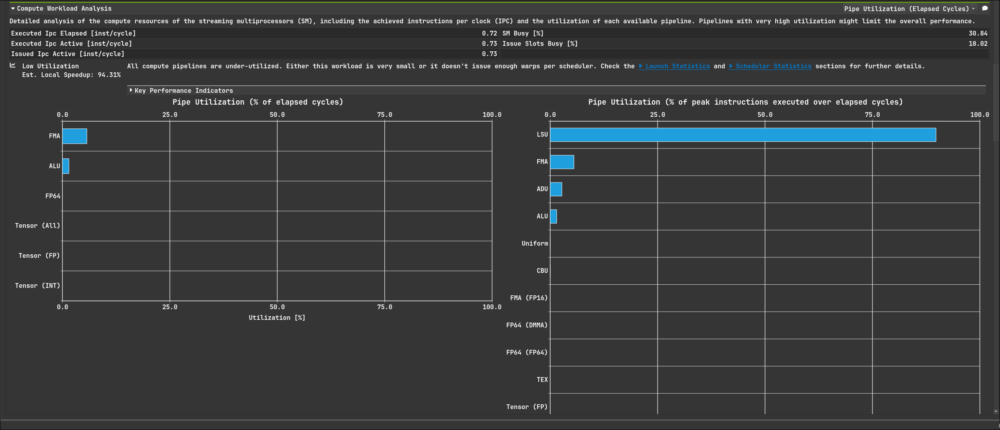
可以看到计算单元非常空闲，只有LSU(Load/Store Uint)繁忙，符合Roofline部分分析的

### Memory Workload Analysis
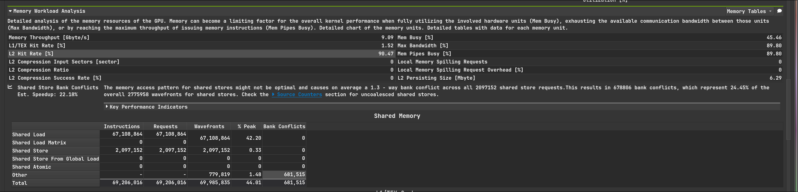
L2的命中率很高，这一定程度上会让DRAM的AI变大，此外smem无bank conflict，other那一栏我也不知道是啥，目前的smem访存模式是高效的
L1难以分析，因为硬件上L1的策略是需要权衡的，而不是L2那样较为固定

### 总结
没用充分发挥硬件计算能力，应该利用GEMM的数据规律加强计算负载

## SGEMM kernel 2:

这次改变了计算的形状，现在是$4096*4096*4096$, 每个线程块只有8个warp, 负责$8*8=64$个元素的计算，所以这次的SM利用率会低点，因为上次每个SM有32个warp,现在只有8个，这整体上就降低了隐藏延迟的能力，会对各种数据造成影响
对比上次，这次的优化在于每个线程负责一块二维区域的计算
### Throughput

因为warp更少了所以SM吞吐降低
#### Roofline Analysis
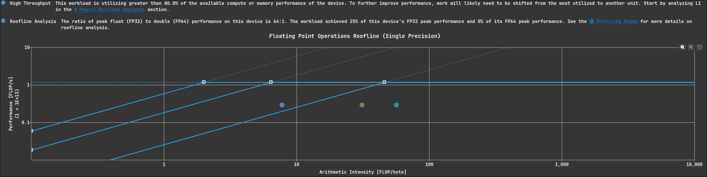
这次的算力明显被更好的利用了(纵坐标和前面的图是不一样的)
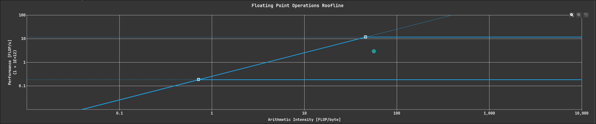
或者只关注DRAM的roofline,离峰值更近了

### Compute Workload Analysis
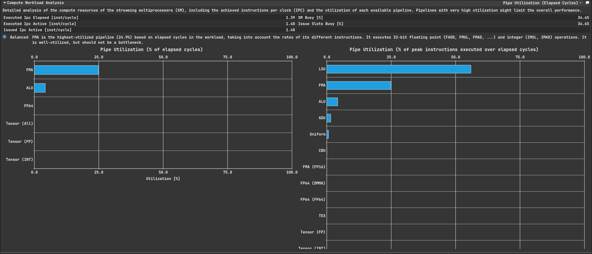
这次的计算单元的利用率也来到了25%

### Memory Workload Analysis

问题暴露了，改为每个线程计算一块2d区域后，访问smem的模式发生了改变，造成了大量的bank conflict，这指明了优化的方向，需要更友好的smem访问模式

### 总结
改进后计算是更密集了，但smem访问模式仍然是低效的

## SGEMM kernel 3:
按warp去分块，减少bank conflict， 数据规模为$2048*2048*2048$,因为保留block为$128*128$，这样负载更合理一些

### Throughput
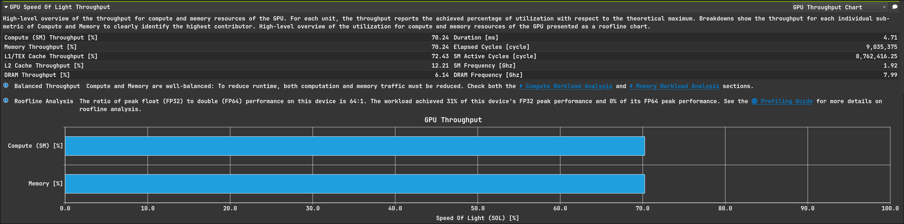
没什么好说的了不想说了

#### Roofline Analysis

此时AI到了232.67，算力进一步提升

### Compute Workload Analysis
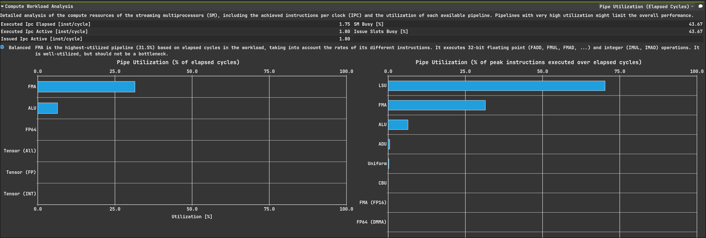
因为减少了bank conflict，所以利用率就上去了

### Memory Workload Analysis
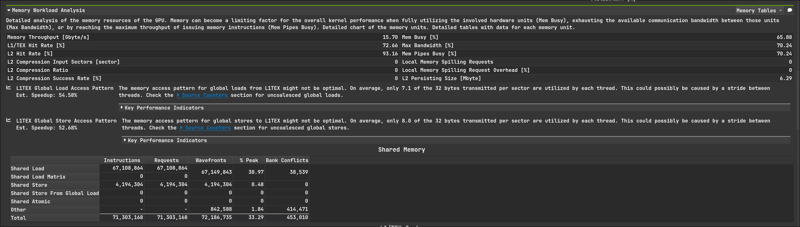
这是warp分块的主要目的，可见bank conflict大量减少

### Source Counters
不过ncu也指出，我们存在大量的非合并gmem访问 


只有大约 22% 的访问是高效的

确实,以下代码完全是没有合并访存
```cuda
    for (int a = 0; a < load_a_per_thread; ++a) {
        uint32_t smem_idx = threadIdx.x + a * threads_per_block;
        uint32_t global_a_idx = (smem_idx % BM) * K + (smem_idx / BM) + k * bK;
        a_smem[smem_idx] = A[global_a_idx];
    }
```

### 总结
目前的gmem访问模式有很大问题，我们应该改变访存模式并使用向量化访存指令去优化kernel

## SGEMM kernel 4:
仅仅只是在3的基础上使用向量化访存，让gmem访问尽可能合并
### Throughput

可见在访存变得更高效后，访存的吞吐都降低了，并不是吞吐都拉满就是好，主要问题在于计算单元是否依赖存储器上的数据，如果不依赖那么计算和访存都一起不停的跑，那很好，但如果依赖的话计算单元在得到操作数之前会一直无法工作。我们的优化每一步都在降低访存的需求，GEMM是3级算子，运算的增长幅度超过数据规模的扩大，这样的优化方向结果毫无疑问是正确的，但也有点没发挥硬件能力，这应该和形状关系比较大

ncu指出 *This workload exhibits low compute throughput and memory bandwidth utilization relative to the peak performance of this device. Achieved compute throughput and/or memory bandwidth below 60.0% of peak typically indicate latency issues. Look at  Scheduler Statistics and  Warp State Statistics for potential reasons.*

这个情况下隐藏延迟的能力没有被发挥好
我们可以增大block内线程的数量，用更多的warp去隐藏延迟，但这样对smem和寄存器大小有要求，再来就是做软件流水

#### Roofline Analysis

访存更高效，计算单元也就不用停顿太久，算力提升

### Compute Workload Analysis

和上面说的一样的，利用率提升是毫无疑问的

### Memory Workload Analysis

说实话我也没想明白为什么这里还有bank conflict，因为向量化访存的关系，数字是进一步下降了

答：这里的bank conflict是L1和smem的冲突，是物理硬件上的，从source页可以看出我们的访存无bank conflict，即查看L1 wavefronts Shared Excessive项


### Source Counters
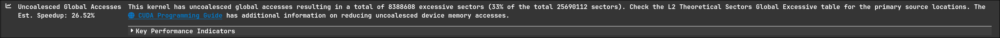
访问gmem是按block去做的，这里还不能合并只能归咎于block的形状了

[这是我当初的一个疏忽，索引设计的有问题，已修正，因合并了gmem访存，会产生不可避免的bank conflict，而原始版本是连续写smem,非连续读gmem]
### 总结
更高效了，但也因此访存没有发挥硬件更强大的能力

## SGEMM kernel 5:
使用双缓冲技巧，不过我个人觉得这其实是软件流水线下的一种技巧

### Throughput
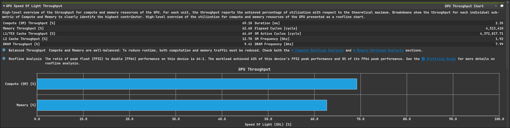
可见使用双缓冲后全部负载都被拉高了，而计算仍然超出访存，这是正确的
因为目前几乎把我所知道的优化技巧都用上了（硬件新特性不算），所以拿来和cuBLAS对比一下
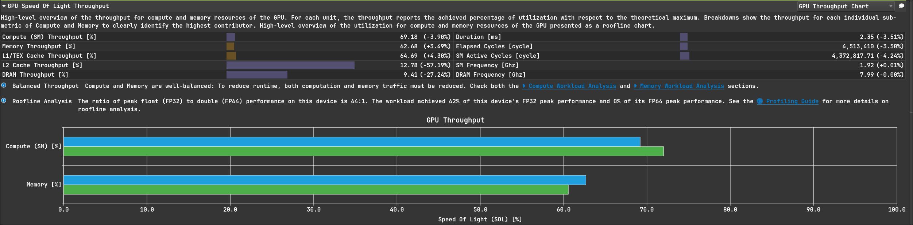
绿色为baseline,是cuBLAS，可见这个版本已经优化的很好了
#### Roofline Analysis
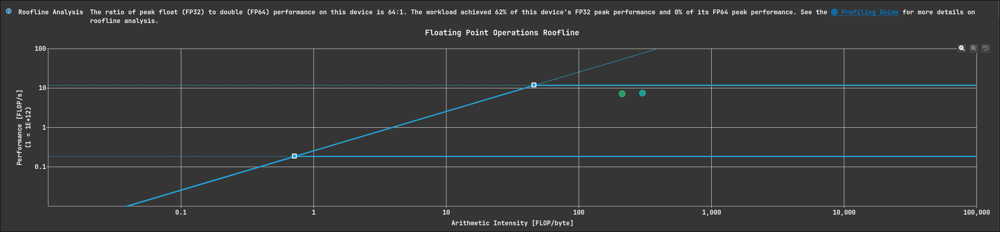
最惊喜的一点，这个版本算力居然都超cuBLAS了，只能归功于形状选得好，更激进

### Compute Workload Analysis

FMA单元也拉到很高的利用率水平了，右侧的LSU不如cuBLAS繁忙个人是认为这个形状选的太好了，访存大部分都是高效的，而cuBLAS为了通用就做不到

### Memory Workload Analysis
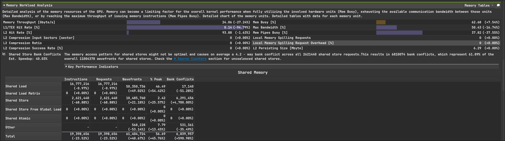
写冲突确实是我造成的，其他的仍然是硬件上难以消除的
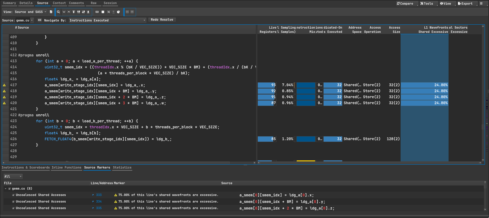

### Warp State Statistics

如图，warp准备好但未被选择的占比高出cuBLAS,这说明我们有足够的隐藏延迟的能力,但和cuBLAS比，我们的数据依赖导致warp停顿就有点多了，不过warp数也不少，保持了SM的活跃，其他的没能力分析，太细了感觉难说，因为对cuBLAS的stall wait偏高感到奇怪查了一下，文档中写着

*smsp__pcsamp_warps_issue_stalled_wait*

Warp 因等待一个固定延迟的执行依赖而停滞。
通常这类原因应非常低，并只会在已经高度优化的 kernel 中成为主要因素。
尝试增加活动 warps 来隐藏延迟、重构代码或展开循环。
另外，也可使用 fast-math 编译选项来使用低延迟指令。

其余的指标放在附录


### 总结
当前的kernel非常不错，已经能用了

## 附录
# Warp Stall Reasons

## 已发出指令 (Issued)

| 指标名 | 中文解释 |
|--------|---------|
| smsp__pcsamp_warps_issue_stalled_barrier | Warp 因等待 CTA 屏障处的兄弟 warps 而停滞。通常由屏障前分支导致。建议均匀划分 block，优化屏障前代码。 |
| smsp__pcsamp_warps_issue_stalled_branch_resolving | Warp 因等待分支目标计算和 PC 更新而停滞。减少跳转/分支和控制流分歧可优化。 |
| smsp__pcsamp_warps_issue_stalled_dispatch_stall | Warp 指令准备好，但调度器因冲突或事件阻止发射。 |
| smsp__pcsamp_warps_issue_stalled_drain | Warp 在 EXIT 后等待未完成的内存操作完成，以释放资源。常见于 kernel 末尾写入大量数据。 |
| smsp__pcsamp_warps_issue_stalled_imc_miss | Warp 等待立即常量缓存（IMC）未命中。访问不同地址会被串行化，代价线性增长。 |
| smsp__pcsamp_warps_issue_stalled_lg_throttle | Warp 等待本地/全局内存指令队列非满。避免冗余访问，减少寄存器溢出，合并 load/store。 |
| smsp__pcsamp_warps_issue_stalled_long_scoreboard | Warp 等待 L1TEX 操作的 scoreboard 依赖。优化内存访问模式，提高 cache 命中率或放入 shared memory。 |
| smsp__pcsamp_warps_issue_stalled_math_pipe_throttle | Warp 等待数学执行管线可用。增加活跃 warps 或调整指令 mix。 |
| smsp__pcsamp_warps_issue_stalled_membar | Warp 等待 memory barrier。避免不必要 barrier 并优化 outstanding memory ops。 |
| smsp__pcsamp_warps_issue_stalled_mio_throttle | Warp 等待 MIO 指令队列非满。减少 shared memory 压力，用更宽的 load/store。 |
| smsp__pcsamp_warps_issue_stalled_misc | Warp 因杂项硬件原因停滞。 |
| smsp__pcsamp_warps_issue_stalled_no_instructions | Warp 等待指令获取或 instruction cache miss。短 kernel 或跳转过多会增加。 |
| smsp__pcsamp_warps_issue_stalled_not_selected | Warp 可执行但未被调度器选中。大量此类表示 warp 足够覆盖延迟，可考虑减少活跃 warp。 |
| smsp__pcsamp_warps_issue_stalled_selected | Warp 被调度器选中并发射指令。 |
| smsp__pcsamp_warps_issue_stalled_short_scoreboard | Warp 等待 MIO（非 L1TEX）的 scoreboard 依赖。常见于 shared memory 或特殊数学指令。 |
| smsp__pcsamp_warps_issue_stalled_sleeping | Warp 内所有线程 blocked/yield/sleep。减少 NANOSLEEP 并使线程同时 sleep。 |
| smsp__pcsamp_warps_issue_stalled_tex_throttle | Warp 等待纹理操作 L1 队列非满。减少纹理/表面操作，合并低宽度访问。 |
| smsp__pcsamp_warps_issue_stalled_wait | Warp 等待固定延迟执行依赖。增加活跃 warps 或重构代码来隐藏延迟。 |
| smsp__pcsamp_warps_issue_stalled_warpgroup_arrive | Warp 等待 WARPGROUP.ARRIVES 或 WARPGROUP.WAIT 指令。 |

## 未发出指令 (Not Issued)

| 指标名 | 中文解释 |
|--------|---------|
| smsp__pcsamp_warps_issue_stalled_barrier_not_issued | 同 Issued 的 barrier 描述，等待 CTA 屏障的兄弟 warp。 |
| smsp__pcsamp_warps_issue_stalled_branch_resolving_not_issued | 同 Issued 的 branch_resolving，等待分支目标计算。 |
| smsp__pcsamp_warps_issue_stalled_dispatch_stall_not_issued | 同 Issued 的 dispatch stall，指令准备好但未发射。 |
| smsp__pcsamp_warps_issue_stalled_drain_not_issued | 同 Issued 的 drain，等待内存操作完成以释放资源。 |
| smsp__pcsamp_warps_issue_stalled_imc_miss_not_issued | 同 Issued 的 IMC miss，等待常量缓存未命中。 |
| smsp__pcsamp_warps_issue_stalled_lg_throttle_not_issued | 同 Issued 的 LG throttle，等待本地/全局内存队列非满。 |
| smsp__pcsamp_warps_issue_stalled_long_scoreboard_not_issued | 同 Issued 的 long scoreboard，等待 L1TEX scoreboard。 |
| smsp__pcsamp_warps_issue_stalled_math_pipe_throttle_not_issued | 同 Issued 的 math pipe throttle，等待数学管线。 |
| smsp__pcsamp_warps_issue_stalled_membar_not_issued | 同 Issued 的 memory barrier。 |
| smsp__pcsamp_warps_issue_stalled_mio_throttle_not_issued | 同 Issued 的 MIO throttle，等待 MIO 队列非满。 |
| smsp__pcsamp_warps_issue_stalled_misc_not_issued | 同 Issued 的杂项硬件原因。 |
| smsp__pcsamp_warps_issue_stalled_no_instructions_not_issued | 同 Issued 的 no instructions，等待指令获取或 cache miss。 |
| smsp__pcsamp_warps_issue_stalled_not_selected_not_issued | 同 Issued 的 not selected，warp 可执行但未被选中。 |
| smsp__pcsamp_warps_issue_stalled_selected_not_issued | 同 Issued 的 selected，warp 被调度器选中发射指令。 |
| smsp__pcsamp_warps_issue_stalled_short_scoreboard_not_issued | 同 Issued 的 short scoreboard，等待 MIO 依赖。 |
| smsp__pcsamp_warps_issue_stalled_sleeping_not_issued | 同 Issued 的 sleeping，warp 内线程 blocked/yield/sleep。 |
| smsp__pcsamp_warps_issue_stalled_tex_throttle_not_issued | 同 Issued 的 tex throttle，等待纹理队列非满。 |
| smsp__pcsamp_warps_issue_stalled_wait_not_issued | 同 Issued 的 wait，等待固定延迟依赖。 |
| smsp__pcsamp_warps_issue_stalled_warpgroup_arrive_not_issued | 同 Issued 的 warpgroup_arrive，等待 WARPGROUP 指令。 |
